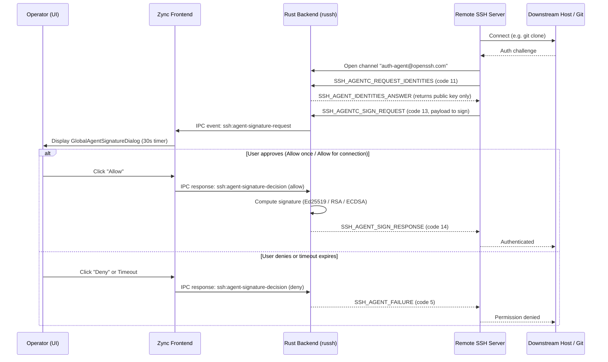

# SSH Agent Forwarding — Architecture & Security Reference

**Last updated:** 2026-08-19  
**Applies to:** Zync v2.24.0+ (Security Hardening Release)  
**Related Docs:** [CONNECTIONS.md](./CONNECTIONS.md), [VAULT.md](./VAULT.md), [SECURITY.md](./SECURITY.md)

Canonical reference for **SSH Agent Forwarding** in Zync: how forwarded keys work, backend virtual agent architecture, interactive consent UI, current capabilities, and planned roadmap improvements.

---

## Table of Contents

1. [Executive Summary](#1-executive-summary)
2. [What is SSH Agent Forwarding?](#2-what-is-ssh-agent-forwarding)
3. [Architecture & Protocol Flow](#3-architecture--protocol-flow)
4. [Current Implementation (Today)](#4-current-implementation-today)
5. [Security Invariants](#5-security-invariants)
6. [Planned Improvements & Roadmap](#6-planned-improvements--roadmap)
7. [File Map](#7-file-map)
8. [Automated Test Suite](#8-automated-test-suite)

---

## 1. Executive Summary

Traditional OpenSSH agent forwarding (`ssh -A`) forwards **all** loaded private keys to the remote host indiscriminately with zero signature visibility or consent prompts. If a remote jump host is compromised, any process on that server can silently sign requests with every key on your machine.

Zync implements a **consent-based, least-privilege Virtual SSH Agent**:
- **Off by default:** Never enabled automatically.
- **Strictly scoped:** Each connection forwards **only one explicitly chosen private key** (local file or encrypted Vault credential).
- **Interactive Consent:** Every cryptographic signing request from the remote server requires user approval via an interactive dialog with a 30-second expiry timeout.
- **Zero Key Leakage:** Private keys never leave the local machine; only cryptographic signature hashes are returned across the SSH channel.

---

## 2. What is SSH Agent Forwarding?

Agent forwarding allows a remote server (e.g. a Bastion/Jump host) to authenticate against downstream targets (e.g. internal databases, private GitHub repositories, or secondary servers) using your local SSH key without copying the private key onto the remote server.

```
┌──────────────┐         SSH Session        ┌────────────────────────┐         SSH / Git         ┌─────────────────────┐
│  Your Laptop │ ─────────────────────────► │ Server A (Jump/Bastion)│ ────────────────────────► │ Server B / GitHub   │
│  (Zync App)  │                            │                        │                           │                     │
│              │ ◄── Sign Request (Prompt)  │                        │ ◄── Auth Challenge        │                     │
│              │ ─── Signed Hash Response ─►│                        │ ─── Verified Hash ───────►│                     │
└──────────────┘                            └────────────────────────┘                           └─────────────────────┘
```

1. You log into **Server A**.
2. Inside Server A's terminal, you run `git clone git@github.com:...` or `ssh internal-db`.
3. Server A requests a key signature from Zync across the `auth-agent@openssh.com` channel.
4. Zync displays an approval prompt with the requesting host identity and key fingerprint.
5. Upon approval, Zync computes the signature locally and returns it to Server A.

---

## 3. Architecture & Protocol Flow



### Protocol Details:
- **`src-tauri/src/ssh.rs`**: Implements `server_channel_open_agent_forward`.
- **Identity Listing (`SSH_AGENTC_REQUEST_IDENTITIES` - 11):** Responds with only the public key bytes of the connection's assigned forwarding key with label `zync-forwarded-key`.
- **Signature Execution (`SSH_AGENTC_SIGN_REQUEST` - 13):** Validates key match, dispatches an IPC event to the frontend, awaits decision over an async oneshot channel, and signs with `russh_keys::key::KeyPair::sign_detached`.

---

## 4. Current Implementation (Today)

### 4.1 UI Configuration
Location: `AddConnectionModal` / `useConnectionForm` &rarr; **Advanced (Optional)** collapsible section.

- **Toggle:** *"Forward an SSH key"* (disabled when no private keys exist in profile).
- **Key Selector Dropdown:**
  - *"This connection's authentication key"* (when the connection itself uses private key or Vault key auth).
  - List of other saved connections that hold private keys or Vault key refs.
- **Safety Badge:** Explains that the remote host can only view the public key and that signing always requires approval.

### 4.2 Interactive Consent Modal
Location: `GlobalAgentSignatureDialog.tsx`

- Mounts at `z-[21000]` in `#modal-portal-root` (above all normal modals).
- Displays:
  - Requesting connection host & user.
  - Key fingerprint (`SHA256:...`).
  - Warning that Zync cannot verify the ultimate destination beyond the immediate SSH connection.
- **Actions:**
  - **`Allow once`**: Authorizes this single signature challenge.
  - **`Allow for connection`**: Authorizes signatures for this active SSH session only (clears on disconnect).
  - **`Deny`**: Rejects signature immediately (returns `SSH_AGENT_FAILURE`).
- **Auto-Expiry:** Unanswered prompts automatically deny after 30 seconds to prevent hanging SSH daemon buffers.

---

## 5. Security Invariants

1. **No Global Key Pool:** Keys are strictly scoped per connection ID. Connection A cannot use the key assigned to Connection B.
2. **Never Forward Passwords:** Agent forwarding exclusively supports public-key cryptography. Passwords cannot be forwarded.
3. **Session-Bound Lifetime:** Session-wide approvals (`Allow for connection`) are stored in-memory in the Rust runtime and wiped immediately when the connection terminates.
4. **Encrypted Vault Storage:** Forwarded Vault keys are decrypted in-memory only when computing the cryptographic signature.

---

## 6. Planned Improvements & Roadmap

| Feature / Improvement | Description | Target Phase | Status |
| :--- | :--- | :--- | :--- |
| **Direct Vault Keys in Dropdown** | Allow picking standalone Vault private keys directly in the dropdown without requiring them to be attached to another saved connection first. | Phase 1 (UX Polish) | ⏳ Planned |
| **Multi-Key Selection** | Upgrade the single-key dropdown to a multi-select checklist (*"Select keys to forward"*) so users can forward 2 or 3 specific keys to a trusted bastion. | Phase 2 | ⏳ Planned |
| **Signature Audit Log** | Add a tab in Connection Details / Notification Center listing recent agent signature requests, timestamps, and approval decisions. | Phase 2 | ⏳ Planned |
| **Downstream Host Pinning** | Record and display known downstream destinations when jumping through intermediate hosts. | Phase 3 | 📋 Exploring |
| **System SSH Agent Bridge** | Option to bridge with external OS agents (OpenSSH `SSH_AUTH_SOCK`, Pageant, 1Password SSH Agent) with the same consent interceptor. | Phase 4 | 📋 Exploring |

---

## 7. File Map

| Layer | File Path | Role |
| :--- | :--- | :--- |
| **Backend Protocol** | `src-tauri/src/ssh.rs` | Virtual agent protocol parser, channel handler, signing dispatcher |
| **Backend Commands** | `src-tauri/src/commands.rs` | `respond_agent_signature` IPC command |
| **Connection Domain** | `src/features/connections/domain/connectionConfig.ts` | Config transforms, `buildAgentForwardingConfig`, validation |
| **Connection IPC** | `src/features/connections/infrastructure/connectionIpc.ts` | `respondAgentSignatureIpc` bridge and payload types |
| **Consent Dialog** | `src/components/connections/GlobalAgentSignatureDialog.tsx` | Top-level interactive signature approval modal |
| **Connection Form** | `src/components/modals/AddConnectionModal.tsx` | Advanced settings UI, key selector dropdown |
| **App Shell** | `src/App.tsx` | Global dialog registration |

---

## 8. Automated Test Suite

Run agent forwarding domain and integration tests:

```bash
# Domain configuration & transforms
npm run compile:agent-tests && node tests/connectionDomain.test.mjs
npm run compile:agent-tests && node tests/connectionFormTransforms.test.mjs

# Rust Virtual Agent protocol unit tests
cd src-tauri
cargo test ssh::tests
```
